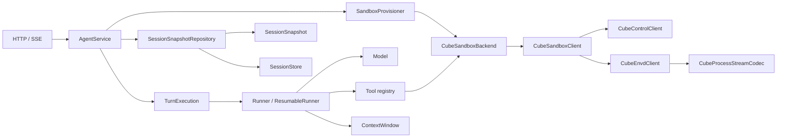

# Architecture

Redy Agents API is a Java 17 Agents API subset. The default `demo` model returns text and does not request tools. The boundaries below let a model adapter and sandbox provider be replaced without changing the HTTP controller.

| Boundary | Owner | Responsibility |
| --- | --- | --- |
| HTTP | `web` | Request validation, response mapping, event stream transport |
| Session orchestration | `core.AgentService`, `core.TurnExecution` | Session and turn transitions, worker scheduling, worker execution, event ordering, recovery decisions |
| Harness | `core.Runner`, `core.ResumableRunner`, `core.LoopRunner` | Model/tool loop, checkpoints, context budget, duplicate-call handling |
| Persistence | `core.SessionSnapshot`, `core.SessionSnapshotRepository`, `core.SessionStore` | Snapshot schema, encoding, and durable storage; the file implementation writes one snapshot per session |
| Sandbox port | `core.SandboxProvisioner`, `core.SandboxToolBackend` | Provider-independent lifecycle and tool operations |
| Cube adapter | `cube.CubeSandboxBackend`, `cube.SandboxTools` | Bind a session's sandbox ID to the ports and the shell/file tools |
| Cube protocol | `cube.CubeSandboxClient` and package-private collaborators | CubeAPI control requests, CubeProxy/envd requests, Connect stream frames |
| Composition | `config` | Bind deployment settings; use registered `Runner`, `SessionStore`, and `SandboxProvisioner` beans when provided, or assemble defaults |

## Session and turn flow

1. `POST /v1/agents/sessions` validates the agent and optional environment. For `cube`, the provider creates a sandbox. `AgentService` saves the sandbox ID in the session snapshot before returning it.
2. A turn saves its input and state, then a worker calls the runner. A `ResumableRunner` produces a checkpoint before each continuation; the bundled `LoopRunner` budgets context, asks the model for a decision, and dispatches registered tools.
3. A local tool receives `ToolExecutionContext` with the session and call ID. Cube tools require an active Cube environment and use only that session's sandbox ID. A pending application-owned function instead moves the session to `requires_action` until a result arrives through `/events`.
4. Events and items are persisted with the session and can be replayed by sequence. On restart, a waiting function remains waiting. An interrupted turn with uncertain effects is failed rather than blindly replayed.
5. Pause, resume, and kill write a durable transition state (`pausing`, `resuming`, `killing`) before calling CubeAPI. While in a transition, the session cannot start a turn. Retrying the same endpoint reconciles an interrupted lifecycle call.

The [OpenAPI contract](../api/openapi.yaml) describes the HTTP surface. `environment`, lifecycle endpoints, and replay cursors are local extensions to the Agents API subset.

## Extension points

- Provide one Spring `Model` bean to replace `DemoModel`; when none is registered, composition uses the demo implementation.
- Register a Spring `Runner` bean for a simple one-shot turn or `ResumableRunner` for checkpointed function handoff and restart recovery. The default runner is `LoopRunner`.
- Register tools in the `LoopRunner` tool map. A tool may validate arguments and results; `ToolFailure` is returned to the model as feedback. Shell exit codes are command results, including nonzero codes.
- Register a Spring `SessionStore` bean to replace the local file store. Register `SandboxProvisioner` and a suitable runner/tool backend to replace CubeSandbox.

## Current scaling limits

`AgentService` still uses one lock for all sessions. It serializes and writes a complete session snapshot while holding that lock, so a slow disk or a long history can delay unrelated sessions. Context, execution messages, and checkpoint messages also hold overlapping conversation state. Moving to per-session synchronization and an append-only event store is the next architectural step; it requires a storage migration and concurrency tests. The current file store is intended for a single service process.

`ResumableRunner` still exposes `LoopCheckpoint`, so alternate checkpoint formats need a contract change. `ContextWindow` treats the latest user message as the start of the protected current turn; steering submitted during a tool exchange can cause earlier messages in that exchange to be compacted. Each SSE subscription currently uses a writer thread and an event-dispatch thread.

Creating a Cube sandbox and writing the first session snapshot are separate operations. A process crash in that interval can leave an orphan sandbox. The Cube protocol has mock tests, but a live cluster has not been available for end-to-end verification.
